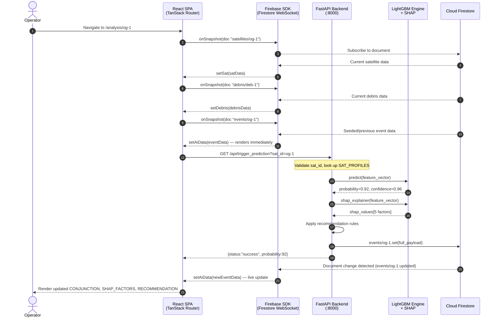
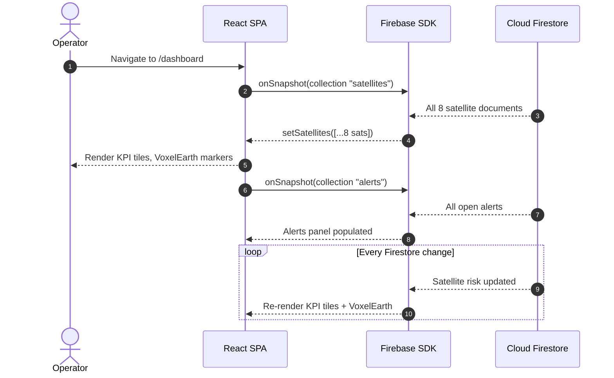
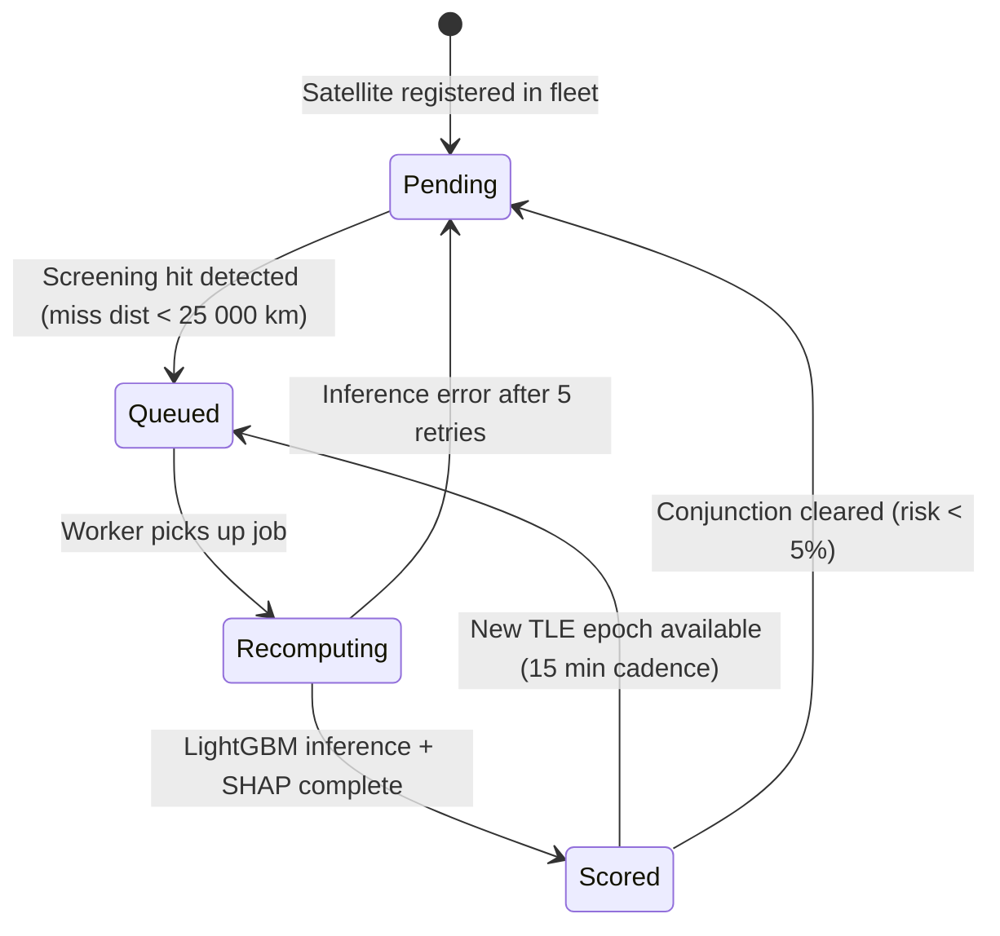
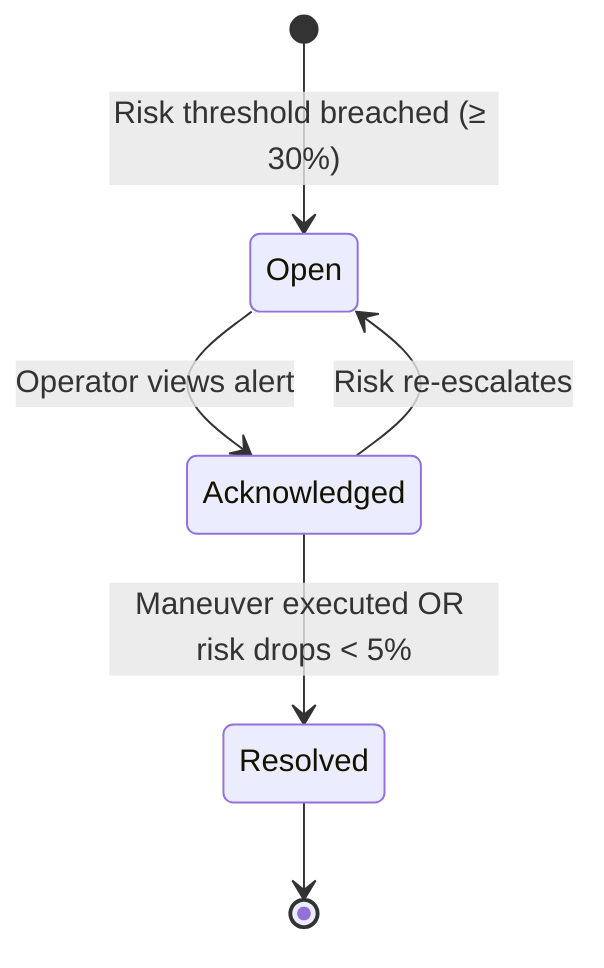
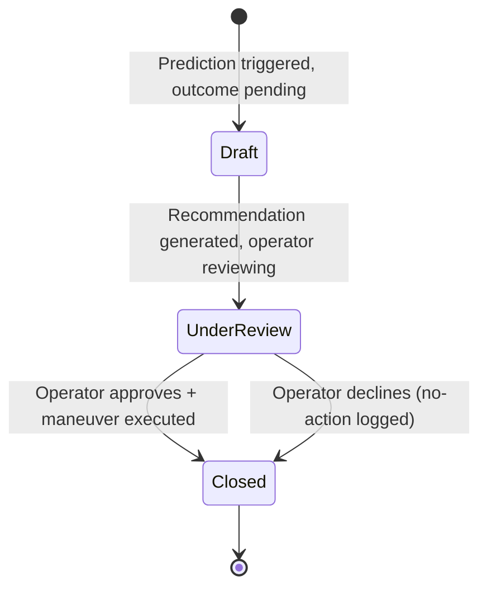

# ARCHITECTURE.md — OrbitalGuardian AI

> **Explainable Decision Intelligence Platform for Space Traffic Management**
> Version: 1.0 · IBM AI Builders Challenge 2026

---

## 1. System Topology

OrbitalGuardian AI follows a **Hybrid Monolith-as-Microservice** pattern:  
a single-tenant, vertically-integrated stack where all components run in process for the MVP, but are decoupled by interface contracts that allow independent horizontal scaling in production.

```
┌─────────────────────────────────────────────────────────────────────┐
│                         CLIENT TIER                                 │
│   React 19 + TanStack Router (SPA/SSR)  ·  Vite 8 dev server       │
│   CesiumJS 3D Globe  ·  Chart.js / Recharts  ·  Lucide Icons       │
└───────────────────────────┬─────────────────────────────────────────┘
                            │ HTTPS / REST  (port 443 / 8000 local)
                            │ Firebase SDK  (Firestore WebSocket)
┌───────────────────────────▼─────────────────────────────────────────┐
│                       APPLICATION TIER                              │
│   FastAPI 0.111  ·  Python 3.11  ·  Uvicorn ASGI                   │
│   ┌─────────────┐  ┌────────────────┐  ┌────────────────────────┐  │
│   │  /api/      │  │  Prediction    │  │  Recommendation        │  │
│   │  trigger_   │  │  Engine        │  │  Engine (Rule-Based    │  │
│   │  prediction │  │  LightGBM v2.1  │  │  Expert System)        │  │
│   └─────────────┘  └───────┬────────┘  └────────────────────────┘  │
│                            │ SHAP TreeExplainer                     │
│                   ┌────────▼────────┐                               │
│                   │ XAI Layer (SHAP)│                               │
│                   └─────────────────┘                               │
└───────────────────────────┬─────────────────────────────────────────┘
                            │ Firebase Admin SDK (gRPC)
┌───────────────────────────▼─────────────────────────────────────────┐
│                       DATA TIER                                     │
│   IBM Cloudant (NoSQL JSON, persistent storage)                     │
│   watsonx.data (Telemetry Data Lake & Analytics)                    │
│   Firebase Firestore (Used strictly as an ephemeral WebSocket       │
│                       bridge for MVP real-time UI synchronization)  │
│   Collections: satellites · debris · events · history · alerts      │
└─────────────────────────────────────────────────────────────────────┘
```

**Hosting:**
| Environment | Frontend | Backend | Database |
|---|---|---|---|
| Development | `localhost:3000` (Vite HMR) | `localhost:8000` (Uvicorn --reload) | Cloudant (Local CouchDB) / Firebase |
| Staging | Lovable.dev Preview URL | Railway / Render free tier | IBM Cloudant (Stage) + Firebase Bridge |
| Production | Vercel Edge (CDN) | Cloud Run (auto-scale, 0→N) | IBM Cloudant (Prod) + watsonx.data |

---

## 2. Tech Stack Matrix

| Layer | Technology | Version | Notes |
|---|---|---|---|
| **Frontend Framework** | React | 19.2.0 | Concurrent mode enabled |
| **Routing** | TanStack Router | 1.170.18 | File-based routes, SSR-ready |
| **Build Tool** | Vite | 8.1.5 | ESM, HMR, tree-shaking |
| **Styling** | Tailwind CSS | 4.2.1 | CSS-first config, zero-runtime |
| **3D Visualization** | CesiumJS | latest (CDN) | WebGL orbit globe |
| **Charts** | Recharts | 2.15.4 | SVG-based analytics |
| **Component Library** | Radix UI Primitives | ^1.x | Accessible headless components |
| **State (server)** | TanStack Query | 5.101.1 | Firestore snapshot + REST caching |
| **Backend Framework** | FastAPI | 0.111.x | OpenAPI 3.1 auto-docs |
| **ASGI Server** | Uvicorn | 0.30.x | Production: gunicorn workers |
| **AI/ML Runtime** | LightGBM | 2.1.x | Gradient-boosted tree classifier |
| **Baseline Model** | Scikit-learn RandomForest | 1.5.x | Benchmark only, not served |
| **Explainability** | SHAP | 0.46.x | TreeExplainer, force plots |
| **Data Processing** | Pandas | 2.2.x | Feature engineering pipeline |
| **Primary Database** | IBM Cloudant | v3 SDK | NoSQL JSON document store |
| **Generative AI** | IBM Granite | watsonx.ai | Dynamic SHAP narrative generation via LangChain |
| **Real-time Bridge** | Firebase Firestore | v12.17 SDK | WebSockets for MVP sandbox (ephemeral) |
| **Auth Provider** | Firebase Auth (MVP: session) | v12.17 | Service-account in backend |
| **Cloud Services** | Google Cloud (Firebase) | — | Firestore, Hosting (optional) |
| **Containerisation** | Docker | 24.x | `Dockerfile` for backend |
| **CI / CD** | GitHub Actions | — | Lint → Test → Build → Deploy |

---

## 3. Core Components & Boundaries

### 3.1 API Gateway (`FastAPI app`)
- **Responsibility:** Route HTTP requests, enforce CORS, validate query parameters, serialize responses.
- **Endpoints exposed:** `/api/trigger_prediction`, `/api/satellites`, `/api/health`
- **CORS policy (MVP):** `allow_origins=["*"]` → tighten to specific frontend origin in production.
- **Request timeout:** 30 s hard limit via Uvicorn `timeout-keep-alive`.

### 3.2 Auth Layer (MVP: Session-Based)
- **Current:** `sessionStorage.setItem("og_auth", "1")` — single hardcoded operator credential (`operator_admin / operator_admin123`).
- **Production target:** Firebase Authentication with custom claims → JWT bearer token validation in FastAPI middleware.
- **RBAC roles (planned):**

| Role | Permissions |
|---|---|
| `operator` | Read all, trigger predictions, approve maneuvers |
| `analyst` | Read-only, export history |
| `admin` | Full CRUD, model promotion, user management |

### 3.3 Prediction Engine (`/backend/prediction/`)
- Loads serialized LightGBM model from `trained_models/LightGBM_collision.json` on startup.
- Accepts satellite pair feature vectors (18 features — see AI_MODEL.md).
- Returns `probability: float [0,1]`, `risk_label: str`, `confidence: float`.
- SHAP TreeExplainer computes factor contributions immediately after inference.

### 3.4 Recommendation Engine (`/backend/recommendation/`)
- **Pattern:** Rule-based expert system — deterministic, auditable, no ML.
- **Rule priority stack:**

```
Priority 1: risk >= 90 AND miss_distance < 500 m  → "Raise Orbit +12 km"
Priority 2: risk >= 60 AND miss_distance < 1000 m → "Lower Orbit -7 km" OR "Raise Orbit"
Priority 3: risk >= 30 AND risk < 60              → "Monitor — no burn"
Priority 4: risk < 30                             → "No action required"
Fallback:   model_confidence < 80                → "Immediate Human Review"
```

### 3.5 Worker Nodes (Async — planned)
- Scheduled orbit screening via APScheduler or Celery + Redis.
- Batch-processes all satellites against the debris catalogue every 15 minutes.
- Writes results to Firestore `events/{sat_id}` — UI picks up via `onSnapshot`.

### 3.6 Storage Layer (IBM Cloudant & watsonx.data)
- **Collections:** `satellites`, `debris`, `events`, `history`, `alerts`, `model_registry`
- **Persistent Storage:** IBM Cloudant serves as the system of record.
- **Data Lake:** watsonx.data ingests historical tracking data for batch analysis.
- **Real-time delivery (MVP):** Firebase Firestore is utilized purely as an ephemeral WebSocket bridge to push updates to connected clients without polling, guaranteeing 60fps performance in the 3D dashboard.

---

## 4. Communication Protocols

### 4.1 REST (Frontend → Backend)
| Method | Path | Trigger | Response shape |
|---|---|---|---|
| `GET` | `/api/trigger_prediction?sat_id={id}` | On analysis page mount | `{status, sat_id, probability, message}` |
| `GET` | `/api/satellites` | Admin/debug | `{satellites: Satellite[]}` |
| `GET` | `/api/health` | Monitoring | `{status: "ok", firebase: bool}` |

**Payload format:** JSON. All responses include `Content-Type: application/json`.

### 4.2 Firebase Firestore (Real-Time Streaming)
- **Protocol:** WebSocket-wrapped gRPC, managed by Firebase SDK.
- **Client subscriptions:**
  - `onSnapshot(collection(db, "satellites"))` — dashboard KPI tile updates.
  - `onSnapshot(doc(db, "events", satId))` — analysis page AI result stream.
  - `onSnapshot(collection(db, "alerts"))` — alert panel live feed.
- **Latency target:** < 300 ms end-to-end (Firebase SLA ~200 ms median, global CDN).

### 4.3 Backend → Firestore (Write)
- **Protocol:** Firebase Admin SDK over gRPC (port 443).
- **Write pattern:** `db.collection("events").document(sat_id).set(payload)` — atomic document replace.

---

## 5. Security & Authentication

### 5.1 MVP Security Model
| Surface | Control |
|---|---|
| Frontend auth | Hardcoded `operator_admin` credential — `sessionStorage` flag |
| Backend CORS | `allow_origins=["*"]` — **must restrict before production** |
| Firebase access | Service account key (`serviceAccountKey.json`) — never committed to VCS |
| HTTPS | Enforced at CDN/load-balancer layer; Vite dev server uses plain HTTP locally |

### 5.2 Production Security Target
- **Identity Provider:** Firebase Authentication (email/password + Google SSO).
- **Token flow:** Client logs in → Firebase issues ID token (JWT, RS256, 1 h TTL) → client sends `Authorization: Bearer <token>` to FastAPI → backend verifies token with Firebase Admin SDK → extracts `uid` and custom claims (`role`).
- **Token refresh:** Firebase SDK auto-refreshes 5 minutes before expiry.
- **RBAC enforcement:** FastAPI `Depends(require_role("operator"))` guard on mutation endpoints.
- **Encryption at rest:** Firestore encrypts all data at rest using AES-256 (Google-managed keys).
- **Encryption in transit:** TLS 1.3 on all channels (CDN → origin, SDK → Firestore).
- **Secrets management:** Google Secret Manager for service account keys and API tokens in production.

---

## 6. Non-Functional Requirements

| Requirement | Target | Measurement |
|---|---|---|
| **API latency (p50)** | < 150 ms | FastAPI response time excl. network |
| **API latency (p99)** | < 500 ms | Cloud Run request latency |
| **Inference time** | < 100 ms | LightGBM predict() incl. SHAP |
| **Firestore read latency** | < 300 ms | SDK `onSnapshot` time-to-first-update |
| **Availability** | 99.5% monthly | Firestore SLA 99.999%; backend Cloud Run SLA 99.95% |
| **Throughput** | 1 000 prediction req/min | Horizontal Cloud Run scaling |
| **Rate limiting** | 100 req/min per IP | FastAPI `slowapi` middleware |
| **Telemetry** | Structured JSON logs | Google Cloud Logging + Sentry for exceptions |
| **Observability** | `/api/health` + Uptime Robot | 60 s polling cadence |
| **Model size** | < 50 MB on disk | LightGBM JSON format |
| **Cold start** | < 3 s (Cloud Run) | Model preloaded at app startup |


---

## 7. System Flow & State Machines

---

## 1. End-to-End Sequence Mapping

### 1.1 Primary Flow: Operator Opens Analysis Page



### 1.2 Dashboard Startup Flow



---

## 2. Async Processing & Queues

### 2.1 Current Implementation (MVP)
- **Synchronous only.** The backend prediction is triggered by the frontend HTTP call on page load.
- No message queue, no background workers, no scheduled tasks in MVP.
- Firestore `onSnapshot` provides real-time push to all connected clients.

### 2.2 Production Async Architecture (Planned)

```
┌────────────────────────────────────────────────────────┐
│  APScheduler / Celery Beat (every 15 min)              │
│  Trigger: fleet_screening_task()                       │
│    → Loop all 8 (→ N) satellites                       │
│    → For each: enqueue prediction job to Redis queue   │
└───────────────────────┬────────────────────────────────┘
                        │ Redis List / BullMQ queue
┌───────────────────────▼────────────────────────────────┐
│  Celery Worker Pool (2–4 workers)                      │
│  - Consume job: {sat_id, features}                     │
│  - Run LightGBM predict() + SHAP                        │
│  - Apply recommendation rules                          │
│  - Write to Firestore events/{sat_id}                  │
│  - If risk >= 60: also write to alerts collection      │
└────────────────────────────────────────────────────────┘
```

### 2.3 Retry Logic & Exponential Backoff

**Backend (Firestore write):**
```python
import tenacity

@tenacity.retry(
    wait=tenacity.wait_exponential(multiplier=1, min=2, max=30),
    stop=tenacity.stop_after_attempt(5),
    retry=tenacity.retry_if_exception_type(Exception),
    before_sleep=tenacity.before_sleep_log(logger, logging.WARNING),
)
def write_event_to_firestore(sat_id: str, payload: dict):
    db.collection("events").document(sat_id).set(payload)
```

**Frontend (prediction trigger):**
```typescript
async function triggerPrediction(id: string, attempt = 0): Promise<void> {
  try {
    await fetch(`http://localhost:8000/api/trigger_prediction?sat_id=${id}`);
  } catch (e) {
    if (attempt < 3) {
      await new Promise(r => setTimeout(r, 2 ** attempt * 1000)); // 1s, 2s, 4s
      return triggerPrediction(id, attempt + 1);
    }
    // After 3 attempts: silent fail — UI still has seeded Firestore data
  }
}
```

### 2.4 Event Queue Schema (Production)

```json
{
  "job_id": "uuid-v4",
  "sat_id": "og-1",
  "triggered_by": "scheduler | operator | alert",
  "enqueued_at": "2026-08-15T14:22:00Z",
  "priority": 1,
  "features": { "...18 feature fields..." },
  "retry_count": 0,
  "max_retries": 5
}
```

---

## 3. State Machine Transitions

### 3.1 Satellite `predictionStatus` Lifecycle



| State | Description | Next states |
|---|---|---|
| `Pending` | No active conjunction; routine monitoring | → `Queued` |
| `Queued` | Job enqueued for next worker pickup | → `Recomputing` |
| `Recomputing` | LightGBM running inference | → `Scored`, `Pending` (on error) |
| `Scored` | Prediction complete, result in Firestore | → `Queued`, `Pending` |

### 3.2 Alert `status` Lifecycle



### 3.3 Mission History `status` Lifecycle



---

## 4. Error Handling & Resiliency

### 4.1 Circuit Breaker Pattern (Production)

The FastAPI backend implements a circuit breaker for Firestore write calls:

```
State: CLOSED (normal operation)
  - All writes pass through
  - Failure counter: 0
  ↓
On 3 consecutive Firestore write failures within 60 s:
  State: OPEN
  - All writes rejected immediately (fail-fast)
  - Returns cached last-known payload
  ↓
After 30 s cooldown:
  State: HALF-OPEN
  - Allow 1 probe write
  - Success → CLOSED
  - Failure → OPEN (reset timer)
```

### 4.2 Timeout Fallbacks

| Operation | Timeout | Fallback |
|---|---|---|
| LightGBM inference | 5 s | Return last cached result from Firestore |
| SHAP computation | 3 s | Return prediction without SHAP; set `shap_available: false` in payload |
| Firestore write | 10 s | Log error, return `{status: "degraded"}` to client |
| Frontend `fetch()` to backend | 8 s (`AbortController`) | UI silently retains seeded Firestore snapshot |
| Firebase `onSnapshot` initial | 10 s | Show full-page skeleton loader; auto-retry |

### 4.3 User-Facing Error Code Mapping

| HTTP Status | Error code | UI behavior |
|---|---|---|
| `200 OK` | — | Normal render |
| `422 Unprocessable Entity` | `INVALID_SAT_ID` | Toast: "Unknown satellite ID. Please select a valid asset." |
| `500 Internal Server Error` | `INFERENCE_FAILED` | Toast: "AI prediction unavailable. Showing last known data." + amber status dot |
| `503 Service Unavailable` | `BACKEND_DOWN` | Toast: "Ground segment offline. Firestore data is live." + red status dot |
| Firebase offline | `FIRESTORE_OFFLINE` | Banner: "Connection lost — displaying last synchronized data." |
| `fetch` timeout | `BACKEND_TIMEOUT` | Toast: "Request timed out. Retrying..." (silent retry ×3) |

### 4.4 Firestore Offline Mode
- Firebase SDK caches the last-read Firestore snapshot in IndexedDB (if `enableIndexedDbPersistence()` enabled).
- Analysis page renders from cache within 100 ms even with no network.
- Stale data indicator: HUD label shows "⚠ Cached data · last sync: {timestamp}" when offline.

### 4.5 Data Consistency Guarantees
- Firestore provides **strong consistency** for single-document reads (events/{sat_id}).
- Collection queries are **eventually consistent** — new satellites may take up to 1 s to appear in dashboard.
- Prediction write → Firestore push → React re-render end-to-end: target < 500 ms.
