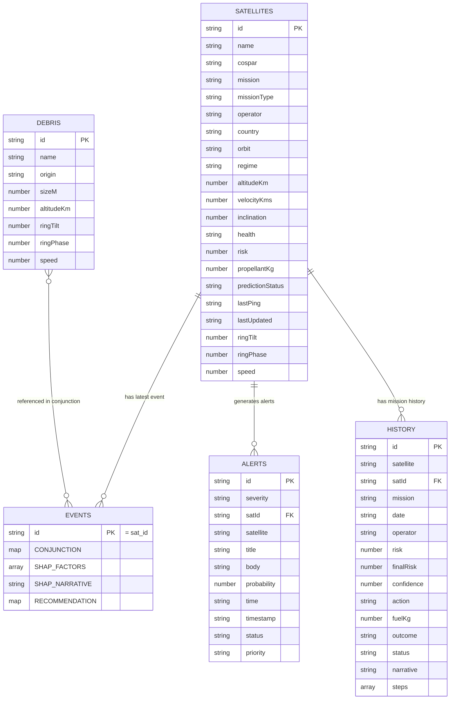

# DATABASE.md — OrbitalGuardian AI

> **Data Architecture & Schema Reference**
> Version: 1.0 · Primary Store: Google Cloud Firestore (NoSQL)

---

## 1. Database Engine Selection

| Layer | Engine | Rationale |
|---|---|---|
| **Primary DB** | Google Cloud Firestore | Real-time `onSnapshot` streaming to React; serverless; automatic multi-region replication; JSON-native document model matches satellite telemetry shape |
| **Caching** | Firestore offline persistence (IndexedDB) | Client-side, enabled via `enableIndexedDbPersistence()` — provides offline-capable reads and in-memory snapshot cache; no separate Redis instance needed in MVP |
| **Cache (Production)** | Redis 7.2 (Cloud Memorystore) | Rate-limit counters, session tokens, prediction result cache (TTL 60 s) to avoid redundant LightGBM calls |
| **Vector DB** | Not applicable in MVP | No vector similarity search required; SHAP produces ranked scalar contributions, not embedding vectors |
| **Time-series (Future)** | BigQuery streaming insert | Long-term telemetry history, conjunction event analytics, model drift monitoring |

---

## 2. Entity-Relationship Schema

### Collection Relationships
| Relationship | Cardinality | Join key |
|---|---|---|
| `satellites` → `events` | 1 : 1 (doc ID = sat_id) | `events/{sat_id}` |
| `satellites` → `alerts` | 1 : N | `alerts.satId == satellites.id` |
| `satellites` → `history` | 1 : N | `history.satId == satellites.id` |
| `debris` → `events` | M : N (referenced inline) | `CONJUNCTION.debrisId` (planned) |

---

## 3. Data Dictionary

### 3.1 `satellites` Collection

| Field | Type | Constraints | Index | Description |
|---|---|---|---|---|
| `id` | `string` | NOT NULL, UNIQUE | Primary key | COSPAR-derived ID (e.g., `og-1`) |
| `name` | `string` | NOT NULL | — | Satellite common name (e.g., `SENTINEL-6B`) |
| `cospar` | `string` | NOT NULL, UNIQUE | — | COSPAR international designator (e.g., `2026-041A`) |
| `mission` | `string` | NOT NULL | — | Mission description (e.g., `Ocean altimetry`) |
| `missionType` | `string` | NOT NULL | Composite | One of: `Earth observation`, `Communications`, `Science`, `Defence`, `Navigation` |
| `operator` | `string` | NOT NULL | — | Operating agency (e.g., `ESA / EUMETSAT`) |
| `country` | `string` | NOT NULL | — | Country of registration |
| `orbit` | `string` | NOT NULL | — | Human-readable orbit label (e.g., `LEO · 1336 km`) |
| `regime` | `string` | NOT NULL | Composite | One of: `LEO`, `MEO`, `GEO`, `SSO`, `HEO` |
| `altitudeKm` | `number` | NOT NULL, > 0 | Range query | Orbital altitude in km |
| `velocityKms` | `number` | NOT NULL, > 0 | — | Orbital velocity in km/s |
| `inclination` | `number` | NOT NULL, [0, 180] | — | Orbital inclination in degrees |
| `health` | `string` | NOT NULL | Composite | One of: `nominal`, `degraded`, `critical` |
| `risk` | `number` | NOT NULL, [0, 100] | Sort, filter | AI-predicted collision risk percentage |
| `propellantKg` | `number` | NOT NULL, >= 0 | — | Remaining propellant mass in kg |
| `predictionStatus` | `string` | NOT NULL | — | One of: `Scored`, `Recomputing`, `Queued`, `Pending` |
| `lastPing` | `string` | NOT NULL | — | Last telemetry timestamp (UTC string) |
| `lastUpdated` | `string` | NOT NULL | — | Human-readable time delta (e.g., `38 s ago`) |
| `ringTilt` | `number` | NOT NULL | — | CesiumJS orbit ring 3D tilt (radians) |
| `ringPhase` | `number` | NOT NULL | — | CesiumJS orbit ring start phase (radians) |
| `speed` | `number` | NOT NULL | — | CesiumJS animation speed multiplier |

### 3.2 `debris` Collection

| Field | Type | Constraints | Index | Description |
|---|---|---|---|---|
| `id` | `string` | NOT NULL, UNIQUE | Primary key | Internal debris ID (e.g., `deb-1`) |
| `name` | `string` | NOT NULL | — | Debris common name (e.g., `COSMOS-1408 FRAG`) |
| `origin` | `string` | NOT NULL | — | Origin event description (e.g., `ASAT test, 2021`) |
| `sizeM` | `number` | NOT NULL, > 0 | Range query | Estimated object size in meters (radar cross-section derived) |
| `altitudeKm` | `number` | NOT NULL, > 0 | Range query | Current altitude in km |
| `ringTilt` | `number` | NOT NULL | — | CesiumJS visualization tilt |
| `ringPhase` | `number` | NOT NULL | — | CesiumJS visualization phase |
| `speed` | `number` | NOT NULL | — | CesiumJS animation speed |

### 3.3 `events` Collection (AI Prediction Output)

Document ID equals `sat_id`. Entire document replaced on each prediction trigger.

| Field | Type | Description |
|---|---|---|
| `CONJUNCTION.tcaUtc` | `string` | Time of Closest Approach in UTC (e.g., `14:47:12 UTC`) |
| `CONJUNCTION.missDistanceM` | `number` | Predicted miss distance at TCA in meters |
| `CONJUNCTION.relativeVelocityKms` | `number` | Closing velocity in km/s |
| `CONJUNCTION.altitudeDeltaKm` | `number` | Altitude separation at TCA in km |
| `CONJUNCTION.inclinationDeltaDeg` | `number` | Orbital plane crossing angle in degrees |
| `CONJUNCTION.probability` | `number` | AI collision probability [0–100] |
| `CONJUNCTION.confidence` | `number` | Model confidence [0–100] |
| `CONJUNCTION.uncertainty` | `number` | Covariance uncertainty in meters |
| `CONJUNCTION.model` | `string` | Model identifier (e.g., `LightGBM + Firebase`) |
| `CONJUNCTION.inferenceMs` | `number` | Inference latency in milliseconds |
| `CONJUNCTION.screenedPairs` | `number` | Number of satellite-debris pairs screened in this batch |
| `SHAP_FACTORS` | `array<SHAPFactor>` | Ranked SHAP feature contributions (max 5 factors) |
| `SHAP_FACTORS[].label` | `string` | Human-readable feature name |
| `SHAP_FACTORS[].plain` | `string` | Plain-language explanation sentence |
| `SHAP_FACTORS[].value` | `string` | Raw feature value with unit |
| `SHAP_FACTORS[].contribution` | `number` | SHAP contribution magnitude [0–1] |
| `SHAP_FACTORS[].direction` | `string` | One of: `increases`, `decreases` |
| `SHAP_NARRATIVE` | `string` | Full plain-language narrative of prediction (1–3 sentences) |
| `RECOMMENDATION.action` | `string` | Recommended maneuver string |
| `RECOMMENDATION.detail` | `string` | Extended rationale |
| `RECOMMENDATION.fuelKg` | `number` | Propellant required in kg |
| `RECOMMENDATION.newRisk` | `number` | Expected post-maneuver risk % |
| `RECOMMENDATION.priority` | `string` | One of: `CRITICAL`, `WARNING`, `INFO` |
| `RECOMMENDATION.window` | `string` | Maneuver execution window (UTC range) |
| `RECOMMENDATION.windowClosesIn` | `string` | Countdown string (e.g., `13 min`) |
| `RECOMMENDATION.deltaV` | `number` | Delta-V required in m/s |
| `RECOMMENDATION.confidence` | `number` | Recommendation confidence [0–100] |
| `RECOMMENDATION.rationale` | `string` | Rule-based decision rationale sentence |

### 3.4 `alerts` Collection

| Field | Type | Constraints | Description |
|---|---|---|---|
| `id` | `string` | NOT NULL, UNIQUE | Alert ID (e.g., `a1`) |
| `severity` | `string` | NOT NULL | One of: `critical`, `warning`, `info` |
| `satId` | `string` | NOT NULL, FK → satellites | Associated satellite ID |
| `satellite` | `string` | NOT NULL | Satellite display name |
| `title` | `string` | NOT NULL | Alert headline |
| `body` | `string` | NOT NULL | Alert detail message |
| `probability` | `number` | [0, 100] | Associated collision risk % |
| `time` | `string` | NOT NULL | Human-readable time delta |
| `timestamp` | `string` | NOT NULL | ISO-ish timestamp string |
| `status` | `string` | NOT NULL | One of: `Open`, `Acknowledged`, `Resolved` |
| `priority` | `string` | NOT NULL | One of: `P1`, `P2`, `P3` |

### 3.5 `history` Collection

| Field | Type | Constraints | Description |
|---|---|---|---|
| `id` | `string` | NOT NULL, UNIQUE | Mission event ID (e.g., `m-2041`) |
| `satellite` | `string` | NOT NULL | Satellite display name |
| `satId` | `string` | NOT NULL, FK | Satellite ID |
| `mission` | `string` | NOT NULL | Mission description |
| `date` | `string` | NOT NULL | Event date (UTC) |
| `operator` | `string` | NOT NULL | Human operator who approved the action |
| `risk` | `number` | [0, 100] | Initial collision risk % |
| `finalRisk` | `number` | [0, 100] | Residual risk after maneuver % |
| `confidence` | `number` | [0, 100] | Model confidence % |
| `action` | `string` | NOT NULL | Maneuver action taken |
| `fuelKg` | `number` | >= 0 | Propellant consumed |
| `outcome` | `string` | NOT NULL | One of: `Avoided`, `No action required`, `Monitoring` |
| `status` | `string` | NOT NULL | One of: `Closed`, `Under review` |
| `narrative` | `string` | NOT NULL | Post-event narrative paragraph |
| `steps` | `array<Step>` | NOT NULL | Ordered timeline steps with `label`, `detail`, `time` fields |

---

## 4. Performance & Indexing

### 4.1 Firestore Composite Indexes
| Collection | Fields | Query pattern |
|---|---|---|
| `satellites` | `regime ASC, risk DESC` | Filter by orbit regime, sort by risk |
| `satellites` | `health ASC, risk DESC` | Filter degraded/critical satellites |
| `alerts` | `severity ASC, timestamp DESC` | Alert panel sorted by recency |
| `alerts` | `satId ASC, status ASC` | Per-satellite alert history |
| `history` | `satId ASC, date DESC` | Per-satellite mission timeline |
| `history` | `outcome ASC, date DESC` | Analytics: avoidance success rate |

### 4.2 Single-Field Indexes (auto-created by Firestore)
- `satellites.risk` — ascending/descending for risk-sorted fleet view.
- `alerts.status` — filter open/acknowledged alerts.
- `history.status` — filter closed/under-review events.

### 4.3 Query Patterns & Complexity
| Query | Collection | Complexity | Notes |
|---|---|---|---|
| Satellite list | `satellites` | O(n) full scan | n=8 in MVP; acceptable |
| Alert feed (open) | `alerts` WHERE `status == "Open"` | O(index) | Covered by status index |
| History by satellite | `history` WHERE `satId == x` ORDER BY `date DESC` | O(index) | Composite index required |
| Live event stream | `events/{sat_id}` document listener | O(1) | Single document snapshot |

### 4.4 Full-Text Search
- Not implemented in Firestore natively. Client-side substring filtering (`String.includes()`) is used in the monitoring page search box.
- **Production upgrade path:** Algolia or Typesense for fleet-wide operator name / mission search.

---

## 5. Retention, Migration & Backup

### 5.1 Migration Framework
- Firestore is schemaless — structural migrations are implemented as one-time Cloud Functions.
- Migration scripts live in `backend/migrations/` and are numbered sequentially: `001_add_model_registry.py`.
- Each script is idempotent (checks for field existence before writing).

### 5.2 Soft-Delete Pattern
- Documents are never physically deleted in production.
- Archives are moved to shadow collections: `satellites_archive/{id}`, `history_archive/{id}`.
- A `deletedAt: Timestamp` field marks soft-deleted records.
- Firestore security rules filter out soft-deleted documents for standard read paths.

### 5.3 Seed & Initial Data
- `backend/seed_db.py` populates all collections with production-representative data.
- Run once per environment: `python backend/seed_db.py`
- Idempotent: uses `set()` (upsert) not `add()`.

### 5.4 Backup Schedule
| Environment | Method | Frequency | Retention |
|---|---|---|---|
| Production | Firestore managed exports to Cloud Storage | Daily at 02:00 UTC | 30 days |
| Staging | Manual export before major schema changes | On-demand | 7 days |
| Development | No backup required | — | — |

### 5.5 Data Volume Estimates
| Collection | MVP size | 1-year projection | Growth driver |
|---|---|---|---|
| `satellites` | 8 docs | ~50 docs | Fleet expansion |
| `debris` | 4 docs (rendered) | 1 000+ docs | Full NORAD catalogue |
| `events` | 8 docs (1 per sat) | 8 docs | Fixed (one per satellite) |
| `alerts` | ~50 docs/day | ~18 000/year | Alert generation rate |
| `history` | ~4 docs | ~200/year | Conjunction events |
