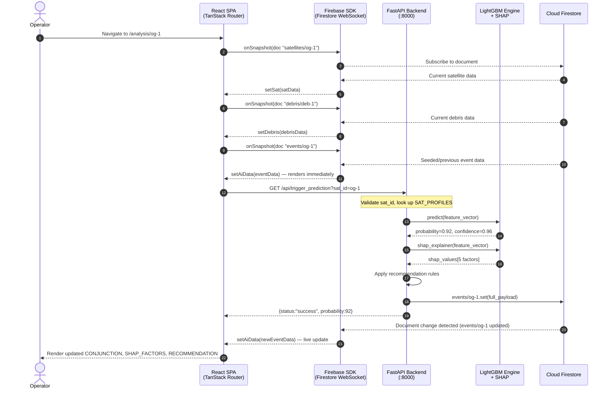
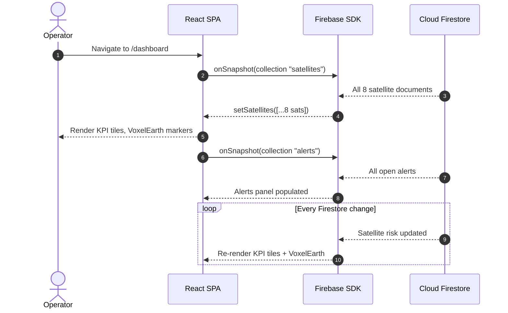
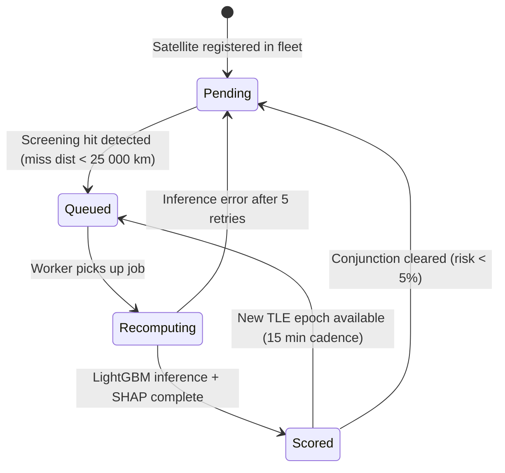
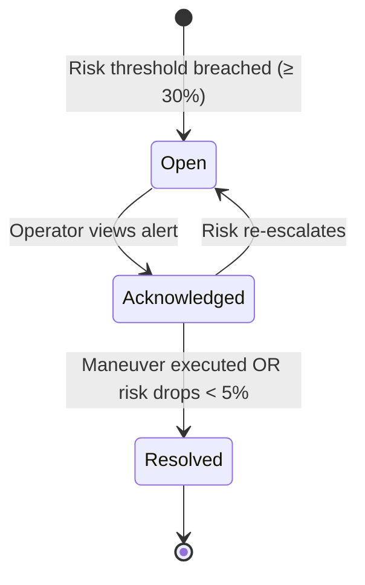
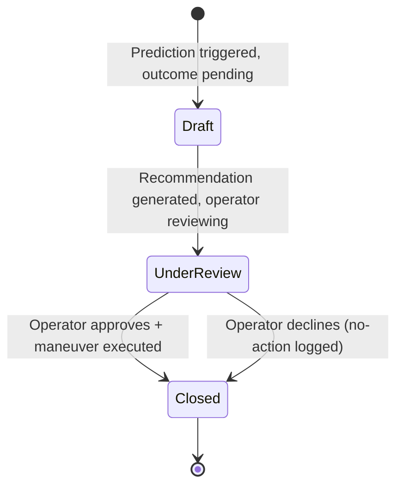

# SYSTEM_FLOW.md — OrbitalGuardian AI

> **End-to-End Request Lifecycle, State Machines & Resiliency Specification**
> Version: 1.0

---

## 1. End-to-End Sequence Mapping

### 1.1 Primary Flow: Operator Opens Analysis Page



### 1.2 Dashboard Startup Flow



---

## 2. Async Processing & Queues

### 2.1 Current Implementation (MVP)
- **Synchronous only.** The backend prediction is triggered by the frontend HTTP call on page load.
- No message queue, no background workers, no scheduled tasks in MVP.
- Firestore `onSnapshot` provides real-time push to all connected clients.

### 2.2 Production Async Architecture (Planned)

```
┌────────────────────────────────────────────────────────┐
│  APScheduler / Celery Beat (every 15 min)              │
│  Trigger: fleet_screening_task()                       │
│    → Loop all 8 (→ N) satellites                       │
│    → For each: enqueue prediction job to Redis queue   │
└───────────────────────┬────────────────────────────────┘
                        │ Redis List / BullMQ queue
┌───────────────────────▼────────────────────────────────┐
│  Celery Worker Pool (2–4 workers)                      │
│  - Consume job: {sat_id, features}                     │
│  - Run LightGBM predict() + SHAP                        │
│  - Apply recommendation rules                          │
│  - Write to Firestore events/{sat_id}                  │
│  - If risk >= 60: also write to alerts collection      │
└────────────────────────────────────────────────────────┘
```

### 2.3 Retry Logic & Exponential Backoff

**Backend (Firestore write):**
```python
import tenacity

@tenacity.retry(
    wait=tenacity.wait_exponential(multiplier=1, min=2, max=30),
    stop=tenacity.stop_after_attempt(5),
    retry=tenacity.retry_if_exception_type(Exception),
    before_sleep=tenacity.before_sleep_log(logger, logging.WARNING),
)
def write_event_to_firestore(sat_id: str, payload: dict):
    db.collection("events").document(sat_id).set(payload)
```

**Frontend (prediction trigger):**
```typescript
async function triggerPrediction(id: string, attempt = 0): Promise<void> {
  try {
    await fetch(`http://localhost:8000/api/trigger_prediction?sat_id=${id}`);
  } catch (e) {
    if (attempt < 3) {
      await new Promise(r => setTimeout(r, 2 ** attempt * 1000)); // 1s, 2s, 4s
      return triggerPrediction(id, attempt + 1);
    }
    // After 3 attempts: silent fail — UI still has seeded Firestore data
  }
}
```

### 2.4 Event Queue Schema (Production)

```json
{
  "job_id": "uuid-v4",
  "sat_id": "og-1",
  "triggered_by": "scheduler | operator | alert",
  "enqueued_at": "2026-08-15T14:22:00Z",
  "priority": 1,
  "features": { "...18 feature fields..." },
  "retry_count": 0,
  "max_retries": 5
}
```

---

## 3. State Machine Transitions

### 3.1 Satellite `predictionStatus` Lifecycle



| State | Description | Next states |
|---|---|---|
| `Pending` | No active conjunction; routine monitoring | → `Queued` |
| `Queued` | Job enqueued for next worker pickup | → `Recomputing` |
| `Recomputing` | LightGBM running inference | → `Scored`, `Pending` (on error) |
| `Scored` | Prediction complete, result in Firestore | → `Queued`, `Pending` |

### 3.2 Alert `status` Lifecycle



### 3.3 Mission History `status` Lifecycle



---

## 4. Error Handling & Resiliency

### 4.1 Circuit Breaker Pattern (Production)

The FastAPI backend implements a circuit breaker for Firestore write calls:

```
State: CLOSED (normal operation)
  - All writes pass through
  - Failure counter: 0
  ↓
On 3 consecutive Firestore write failures within 60 s:
  State: OPEN
  - All writes rejected immediately (fail-fast)
  - Returns cached last-known payload
  ↓
After 30 s cooldown:
  State: HALF-OPEN
  - Allow 1 probe write
  - Success → CLOSED
  - Failure → OPEN (reset timer)
```

### 4.2 Timeout Fallbacks

| Operation | Timeout | Fallback |
|---|---|---|
| LightGBM inference | 5 s | Return last cached result from Firestore |
| SHAP computation | 3 s | Return prediction without SHAP; set `shap_available: false` in payload |
| Firestore write | 10 s | Log error, return `{status: "degraded"}` to client |
| Frontend `fetch()` to backend | 8 s (`AbortController`) | UI silently retains seeded Firestore snapshot |
| Firebase `onSnapshot` initial | 10 s | Show full-page skeleton loader; auto-retry |

### 4.3 User-Facing Error Code Mapping

| HTTP Status | Error code | UI behavior |
|---|---|---|
| `200 OK` | — | Normal render |
| `422 Unprocessable Entity` | `INVALID_SAT_ID` | Toast: "Unknown satellite ID. Please select a valid asset." |
| `500 Internal Server Error` | `INFERENCE_FAILED` | Toast: "AI prediction unavailable. Showing last known data." + amber status dot |
| `503 Service Unavailable` | `BACKEND_DOWN` | Toast: "Ground segment offline. Firestore data is live." + red status dot |
| Firebase offline | `FIRESTORE_OFFLINE` | Banner: "Connection lost — displaying last synchronized data." |
| `fetch` timeout | `BACKEND_TIMEOUT` | Toast: "Request timed out. Retrying..." (silent retry ×3) |

### 4.4 Firestore Offline Mode
- Firebase SDK caches the last-read Firestore snapshot in IndexedDB (if `enableIndexedDbPersistence()` enabled).
- Analysis page renders from cache within 100 ms even with no network.
- Stale data indicator: HUD label shows "⚠ Cached data · last sync: {timestamp}" when offline.

### 4.5 Data Consistency Guarantees
- Firestore provides **strong consistency** for single-document reads (events/{sat_id}).
- Collection queries are **eventually consistent** — new satellites may take up to 1 s to appear in dashboard.
- Prediction write → Firestore push → React re-render end-to-end: target < 500 ms.
