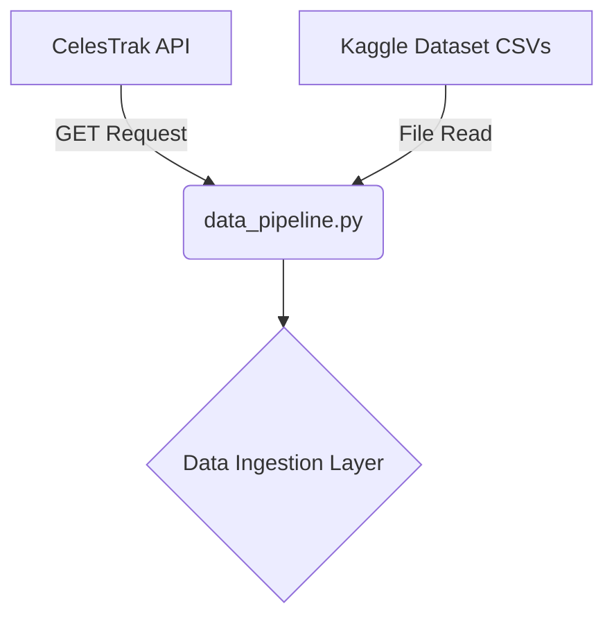

# Phase 1: Data Collection (Ingestion Pipeline)

## Overview
Phase 1 forms the foundational layer of the OrbitalGuardian AI platform. Space Traffic Management (STM) relies on massive volumes of telemetry and tracking data to identify where objects are in space. In this phase, the system connects to external data providers to ingest real-world satellite and debris data.

## Architecture & Workflow
The data collection pipeline operates dynamically, fetching live tracking data and static historical data for the AI model. 

1. **Static Data Loading**: Loads historical Conjunction Data Messages (CDMs) from massive CSV files provided by the European Space Agency (ESA) Kelvins Challenge.
2. **Live Data Fetching**: Executes a REST API call to CelesTrak to download the latest Two-Line Elements (TLEs) for active satellites.

### Data Flow Diagram

## Inputs
- **CelesTrak URL**: `https://celestrak.org/NORAD/elements/gp.php?GROUP=active&FORMAT=tle`
- **ESA/Kaggle Dataset**: `train_data.csv` (233 MB) containing thousands of recorded satellite approach events.

## Processing Details
The script (`src/data_pipeline.py`) relies on the `requests` and `pandas` libraries. 
- For **CelesTrak**, it initiates an HTTP GET request to pull the raw text file of TLEs. 
- For the **Kaggle Dataset**, it uses `pandas.read_csv()` to parse the massive dataset into a DataFrame. Due to the extreme size of the dataset, it supports `nrows` limiting to prevent memory overflows during the MVP testing phase.

## Outputs and Results
- **CelesTrak Output**: A raw text file `data/celestrak_active.txt` containing live orbital tracking strings.
- **Kaggle Output**: A Pandas DataFrame object loaded into system memory, representing the historical collision events.

This phase results in raw, unfiltered data resting in memory and on disk, ready to be passed to Phase 2 for sanitation.
