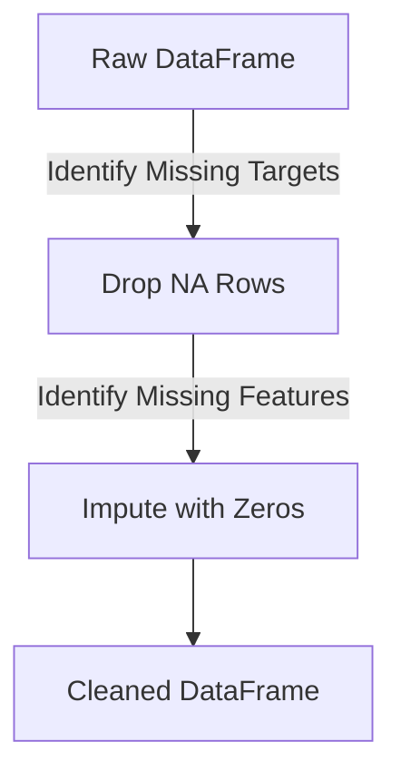

# Phase 2: Data Cleaning

## Overview
Raw space telemetry data is notoriously noisy, incomplete, and filled with anomalies due to sensor errors (e.g., radar tracking gaps). Phase 2 is responsible for scrubbing this data so that the Machine Learning models in Phase 4 do not crash or learn from corrupted data.

## Architecture & Workflow
The data cleaning process happens immediately after ingestion in `src/data_pipeline.py`. It serves as the bridge between raw inputs and feature extraction.

1. **Target Validation**: Ensures every row of data has a known outcome (Collision vs. Safe).
2. **Missing Value Imputation**: Replaces `NaN` (Not a Number) values with safe default mathematical proxies (like `0` or mean values) to prevent code execution failures.

### Data Flow Diagram

## Inputs
- The raw `pandas.DataFrame` generated at the end of Phase 1.
- Specifically, it looks at the `risk` column (the true collision probability provided by the ESA).

## Processing Details
The script uses pandas vectorized operations for extreme speed:
1. `df.dropna(subset=['risk'])`: If the ESA failed to provide a calculated risk probability for a specific event, the row is entirely useless for supervised machine learning. This command deletes the event from the dataset.
2. `df.fillna(0)`: The dataset contains covariance matrices and radar cross-sections. If a radar station missed a reading, it results in a `NaN`. We fill these with `0` so the mathematical formulas in Phase 3 don't throw dividing-by-zero errors.

## Outputs and Results
- **Output File**: `data/clean_sample.csv`
- **Result**: The dataset size is reduced slightly (as corrupted rows are dropped), but the remaining data is guaranteed to be 100% mathematically valid. This cleanly formatted CSV is saved to the disk to be picked up by the Feature Engineering module.
