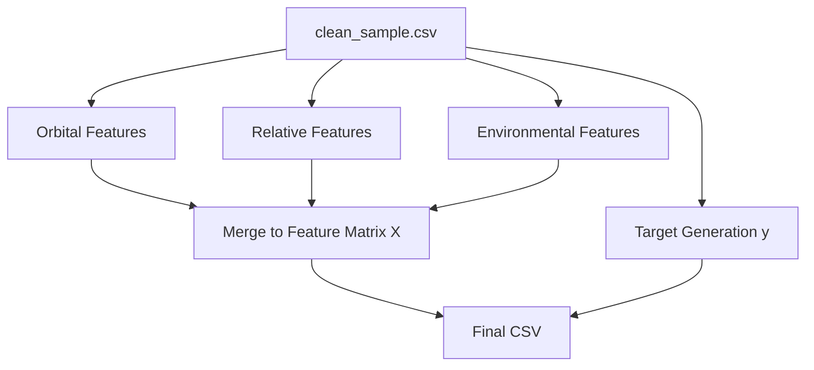

# Phase 3: Feature Engineering

## Overview
Machine Learning algorithms do not inherently understand space physics. Phase 3 acts as the translation layer. It takes the cleaned dataset and extracts the exact physical and orbital properties (Features) required to accurately predict a satellite collision. 

## Architecture & Workflow
This phase is handled entirely by `src/features.py`. The architecture separates extraction into three distinct domains before merging them into a final "Feature Matrix" (`X`) and a "Target Label" (`y`).

1. **Orbital Extraction**: Extracts exact Keplerian parameters.
2. **Relative Extraction**: Extracts geometric distance and speed.
3. **Environmental Extraction**: Extracts space weather phenomena.

### Data Flow Diagram

## Inputs
- **Cleaned Data**: `data/clean_sample.csv` (Generated in Phase 2).

## Processing Details
The script isolates highly specific columns from the ESA dataset:
* **Orbital Features:** Extracts J2000 Semi-Major Axis (`t_j2k_sma`), Eccentricity, and Inclination for both the Target satellite and Chaser object. It also extracts the Radar Positional Uncertainty (`t_sigma_r`), which is heavily relied upon in Astrodynamics to calculate confidence.
* **Relative Features:** Extracts the physical `miss_distance`, `relative_speed`, and `time_to_tca` (Time to Closest Approach). It also extracts the 3D Relative Position in the RTN (Radial, Transverse, Normal) reference frame.
* **Environmental Features:** Extracts the `F10` and `F3M` solar flux indices, alongside the Geomagnetic `AP` index. These dictate atmospheric density, which causes satellites to drag and unexpectedly drop in altitude.
* **Target Mapping:** The original ESA `risk` is a log-10 probability. The script translates this into a Binary Classification problem. If the risk is greater than $10^{-6}$ (e.g. `risk > -6.0`), it tags the event with a `1` (High Risk). Otherwise, it tags it `0` (Safe).

## Outputs and Results
- **Output File**: `data/features_ready.csv`
- **Result**: The output is a highly optimized, purely numeric Feature Matrix. It strips away all string labels and irrelevant IDs, leaving only the pure physics data and the binary `1` or `0` target label required to train the AI.
