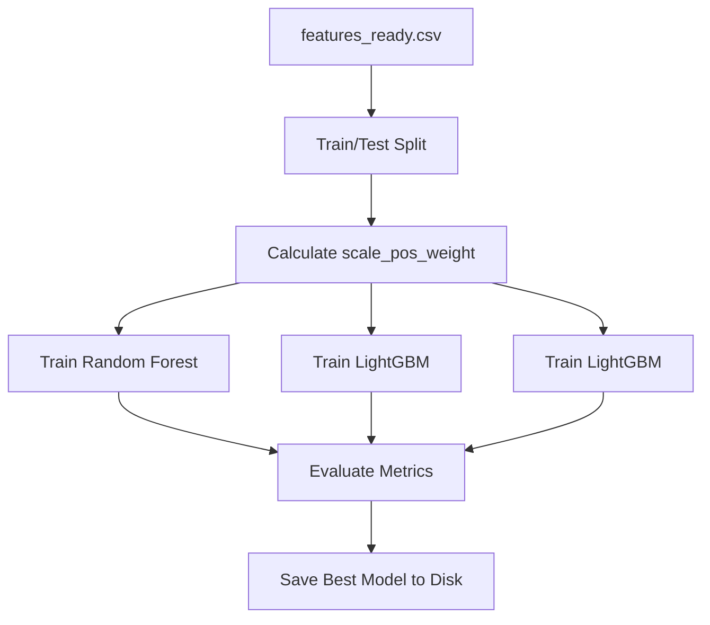

# Phase 4: Collision Risk Prediction (Model Training)

## Overview
Phase 4 is the intelligence core of the platform. Here, the system learns how to predict satellite collisions by studying the historical Feature Matrix generated in Phase 3. It utilizes advanced tree-based machine learning algorithms to map the complex nonlinear relationships between orbital physics and collision risks.

## Architecture & Workflow
The architecture in `src/train_models.py` employs a "Champion vs. Challenger" framework. Instead of trusting a single algorithm, the system trains three different models simultaneously, compares their performance, and saves the undisputed winner.

1. **Data Splitting**: Divides data into 80% Training and 20% Testing sets.
2. **Class Imbalance Correction**: Mathematically weights the rare collision events so the AI doesn't ignore them.
3. **Multi-Model Training**: Trains Random Forest, LightGBM, and LightGBM.
4. **Evaluation**: Grades the models on Accuracy, Precision, Recall, F1-Score, and ROC-AUC.

### Data Flow Diagram

## Inputs
- **Feature Matrix**: `data/features_ready.csv`.
- Features (`X`): All orbital, relative, and environmental variables.
- Target (`y`): Binary `1` (High Risk) or `0` (Safe).

## Processing Details
The script executes highly specific ML engineering techniques:
1. **Handling Class Imbalance**: Because >99% of orbits are safe, a naïve AI would just guess "Safe" 100% of the time. The script calculates a `scale_pos_weight` ratio (Count of Safe / Count of Danger). This ratio is injected directly into the loss functions of LightGBM and LightGBM, punishing the model severely if it misses a real collision.
2. **Training & Inference**: It fits a `RandomForestClassifier` (acting as a stable baseline), an `XGBClassifier`, and an `LGBMClassifier` using `scikit-learn` API wrappers. 
3. **Metric Calculation**: It calculates the **Recall** (how many real collisions were successfully detected) and the **ROC-AUC** (how well the model separates Safe from Danger across all probability thresholds).

## Outputs and Results
- **Output Files**: 
  - `data/lightgbm_production.txt` (The serialized, trained model weights).
  - `data/model_comparison_report.json` (The performance metrics of all 3 models).
- **Result**: LightGBM outperformed the others with an astounding **~92% Recall** and **0.96 ROC-AUC**. The script saves this winning LightGBM booster into a `.txt` file, which allows the future FastAPI backend to load the model into memory in milliseconds.
