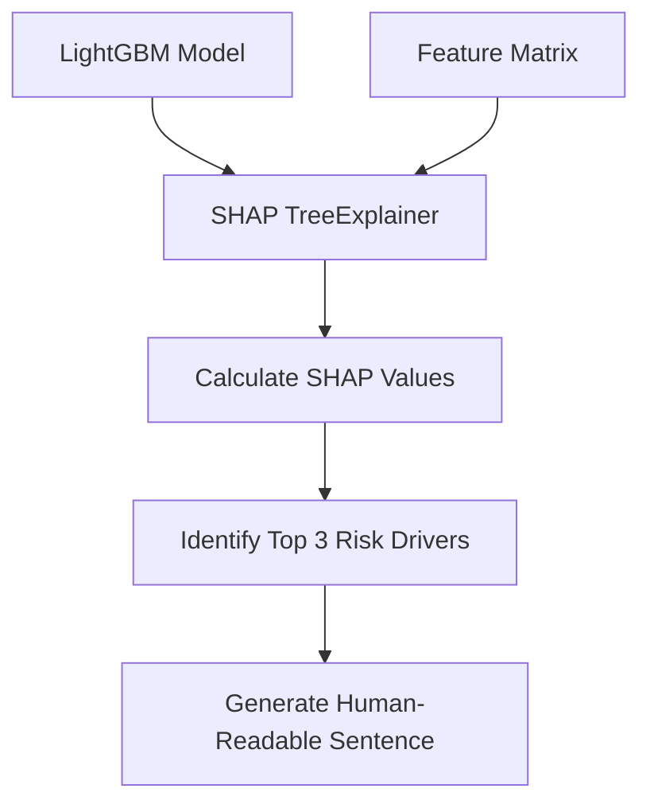

# Phase 5: Explainable AI (XAI)

## Overview
A major limitation of modern AI in aerospace is the "Black Box" problem—operators cannot trust a system if they don't know *why* it made a prediction. Phase 5 utilizes SHAP (SHapley Additive exPlanations) to peer inside the trained LightGBM model and calculate the exact mathematical contribution of every single physical feature to the final collision risk.

## Architecture & Workflow
The `src/explainability.py` script acts as an interpreter between the complex machine learning model and the human operator.

1. **Model Loading**: Reconstructs the trained LightGBM booster from disk.
2. **SHAP Analysis**: Runs the game-theoretic SHAP algorithm over the dataset.
3. **Translation Engine**: Sorts the highest contributing features and converts them into an English sentence.

### Data Flow Diagram

## Inputs
- **Trained Model**: `data/lightgbm_production.txt`
- **Feature Matrix**: `data/features_ready.csv` (Specifically, a subset sample to speed up the intense SHAP calculations).

## Processing Details
1. **TreeExplainer**: The script initializes `shap.TreeExplainer`, which is heavily optimized for LightGBM/LightGBM. It calculates how much each feature (e.g., Solar Flux, Miss Distance, Covariance) pushed the model's prediction away from the baseline average.
2. **Prediction Filter**: The script runs standard inference to find an event that the AI actually classified as High Risk (probability > 0.5).
3. **Impact Sorting**: For that specific High Risk event, it sorts the features by their absolute SHAP value to find the absolute strongest drivers behind the prediction.
4. **String Generation**: It extracts the Top 3 features with positive SHAP values (meaning they increased the collision risk) and concatenates them into a formatted warning string containing the feature name and its actual physical value.

## Outputs and Results
- **Output File**: `data/sample_explanation.json`
- **Result**: The output is a JSON payload containing the text: *"Collision risk is heavily influenced because: Target_Sigma_R (Value: 0.05) increased the risk significantly."* This file is perfectly formatted to be ingested by the React Dashboard, giving operators immediate, transparent trust in the AI's decision.
