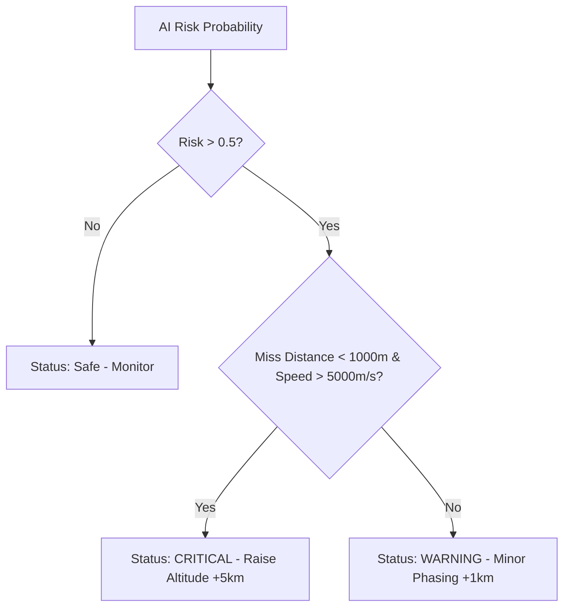

# Phase 6: Decision Recommendation Engine

## Overview
Predicting a collision and explaining it is not enough; the system must also advise the operator on how to prevent it. Phase 6 is the final step in the intelligence workflow: a Rule-Based Expert System that takes the physical parameters of a dangerous event and outputs a concrete, actionable spacecraft maneuver recommendation.

## Architecture & Workflow
The `src/recommendation.py` script functions as a deterministic logic tree. While Phase 4 uses probabilistic Machine Learning, Phase 6 uses strict rules to ensure spacecraft safety protocols are rigidly adhered to.

1. **Risk Triage**: Sorts the event into Safe, Warning, or Critical based on AI probability.
2. **Physics Evaluation**: Evaluates the physical distance and relative speed of the encounter.
3. **Maneuver Generation**: Assigns an operational maneuver (e.g., Altitude change, Phasing change) and estimates the resulting post-maneuver risk.

### Data Flow Diagram

## Inputs
This module takes direct telemetry and prediction data (currently simulated for the MVP):
- `risk_probability`: The confidence score from the LightGBM model (e.g., 0.92).
- `miss_distance`: The physical distance between objects in meters.
- `relative_speed`: The relative velocity in meters per second.

## Processing Details
The expert system evaluates cascading `if/elif` logic gates:
1. **Gate 1**: Checks if the AI Risk is below 50%. If so, the operation is standard.
2. **Gate 2 (Critical)**: If the distance is dangerously close (< 1000m) and the speed is hyper-lethal (> 5000 m/s), the system triggers a **CRITICAL** status. It recommends a massive Hohmann transfer (Raise Orbit by +5km) to drastically separate the orbital planes, estimating the new risk will drop safely to 0.000001.
3. **Gate 3 (Warning)**: If the event is high risk but the distance is wider or speed is slower, it triggers a **WARNING** status. It recommends a highly fuel-efficient "Phasing Maneuver" (adjusting the satellite's position along its current track by +1km) to dodge the debris without wasting propellent to change altitude planes.

## Outputs and Results
- **Output File**: `data/sample_recommendation.json`
- **Result**: The module generates a structured JSON object containing the `status` level, the exact `action` string, and the `estimated_new_risk`. This payload acts as the final piece of data required by the Frontend Dashboard to visualize the proposed maneuver in the CesiumJS 3D Earth environment.
